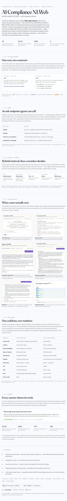
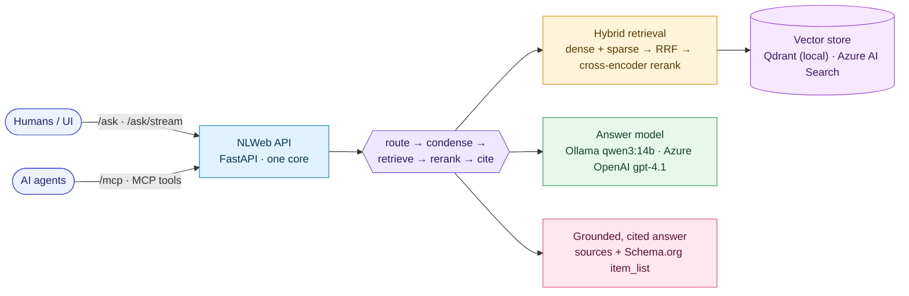

# AI Compliance NLWeb

**A conversational AI-compliance workbench.** An [NLWeb](https://github.com/nlweb-ai/NLWeb)-style
layer over the world's AI rules and standards, exposed two ways over one
retrieval + answer core: **`/ask`** for people (structured JSON) and **`/mcp`** for
agents (MCP tools). Ask natural-language questions about the EU AI Act, ISO/IEC 42001,
the NIST AI RMF, GDPR, US executive orders, and national frameworks — and get
**grounded, cited** answers. RAG-only and accuracy-first: every claim cites
`[framework §section, p.N]`, and when the corpus can't support an answer, it says so
rather than guessing.

**▶ Overview site:** [starman69.github.io/ai-compliance-nlweb](https://starman69.github.io/ai-compliance-nlweb/) (GitHub Pages) ·
**Write-up:** [*NLWeb + MCP: Why Every Website Will Soon Need an /ask Endpoint*](https://medium.com/@dave-patten/nlweb-mcp-why-every-website-will-soon-need-an-ask-endpoint-92c8bac9d4da)

<p align="center">
  <a href="https://starman69.github.io/ai-compliance-nlweb/"></a>
  <br/><sub><em>The single-page overview (<a href="https://starman69.github.io/ai-compliance-nlweb/">GitHub Pages</a> · source <a href="site/index.html"><code>site/index.html</code></a>) — corpus, NLWeb/MCP contracts, hybrid retrieval, dual runtime, and metrics.</em></sub>
</p>

> **Status: working POC.** The local stack answers with real models on GPU; the
> `/ask` and `/mcp` contracts are live, with token-by-token SSE streaming. On the
> golden-QA eval: **36/36 · 100% retrieval hit-rate · 100% intent accuracy · 97%
> mean term coverage** (local `qwen3:14b`), spanning all five tiers and every intent.

---

## What it does

Ask questions like:

- *"How do I implement ISO 42001?"*
- *"Compare US vs EU AI policy."*
- *"What records must I keep under the EU AI Act for a high-risk system?"*
- *"What does GDPR say about automated decision-making for AI?"*

…and get an answer **grounded in the actual regulatory text**, with a collapsible
**Sources** list (document · section · page · link), a **confidence** signal, a live
**token-usage** readout, and **token-by-token streaming**. Every claim is cited; if the
corpus doesn't support an answer, it says so.

## How it works



- **One core, two contracts.** `/ask` returns structured JSON (Schema.org `ItemList`)
  for humans/UI; `/mcp` (JSON-RPC, MCP) exposes the same retrieval + answer core as
  tools for agents. Both accept the same payload; `query` is the only required field. A
  `mode` of `list` / `summarize` / `generate` controls whether the LLM runs at all
  (`list` is retrieval-only — no model call).
- **Accuracy first.** Structure-aware chunking (citations name the article/clause),
  hybrid dense + sparse retrieval with RRF fusion, a cross-encoder reranker, doc-hint
  steering (naming a framework scopes retrieval to it), and citation-enforced generation.
- **Dual runtime profile.** `RUNTIME_PROFILE=local` runs entirely on Docker (Qdrant +
  Ollama `qwen3:14b` + `mxbai-embed-large`, 1024-d); `RUNTIME_PROFILE=azure` uses Azure
  OpenAI (`gpt-4.1` + `text-embedding-3-small`, 1536-d) with Azure AI Search, provisioned
  by Bicep. Each profile is a matched {store, embedder, answer-model} triple.

Architecture docs and Mermaid diagrams live in
[`docs/poc/`](docs/poc/) — see [`10-diagrams.md`](docs/poc/10-diagrams.md) and
[`01-architecture.md`](docs/poc/01-architecture.md).

## The corpus

**48 open-access documents · 32 frameworks**, across five tiers — **100% open-access,
no paywalled content**:

| Tier | Focus | Docs |
|---|---|---:|
| Global / International standards | ISO/IEC AI standards (open summaries), OECD, UNESCO, G7, Council of Europe | 8 |
| EU / UK / National frameworks | EU AI Act & digital rulebook, GDPR, UK, Canada (AIDA), Singapore, Brazil, China | 16 |
| US Federal | NIST AI RMF family, OMB memos, 2025 executive orders, NIST CSF / SP 800-53, FedRAMP | 13 |
| US State | Colorado, Texas, Utah, California, New York City, Illinois | 8 |
| Sector / Cloud | Cloud Security Alliance, Microsoft, Google | 3 |

A versioned manifest ([`manifest/corpus.yaml`](manifest/corpus.yaml)) is the source of
truth; [`scripts/fetch_corpus.py`](scripts/fetch_corpus.py) pulls the open-access texts.
ISO/IEC standards (which are copyrighted) are represented by **open, non-normative
authored summaries** in [`manifest/summaries/`](manifest/summaries/) — the corpus is fully
reproducible from open sources, with no paywalled content committed.

## Quick start

**Fast path — Mock backend** (instant, offline, no model server; how tests/CI run).
Grounded, cited answers come from a committed offline seed — no fetch/ingest needed:

```bash
python -m venv .venv && . .venv/bin/activate && pip install -r requirements-dev.txt
NLWEB_BACKEND=mock PYTHONPATH=src uvicorn api.app:app --port 8000        # API
cd src/web && npm install && npm run dev                                 # http://localhost:8088
```

**Full local stack** — real `qwen3:14b` (GPU) + Qdrant + hybrid retrieval:

```bash
cd infra/compose && cp .env.example .env && docker compose up -d         # project: "compliance"
docker compose exec ollama ollama pull qwen3:14b
docker compose exec ollama ollama pull mxbai-embed-large
# the corpus ships in sources/open/ — just ingest (chunk → embed → Qdrant):
cd ../.. && RUNTIME_PROFILE=local NLWEB_BACKEND=real PYTHONPATH=src python scripts/ingest.py
open http://localhost:8088                                               # or: scripts/fetch_corpus.py to refresh
```

Full walkthrough → [`docs/poc/12-local-runtime.md`](docs/poc/12-local-runtime.md). Ask the API directly:

```bash
curl -s localhost:8000/ask -H 'content-type: application/json' \
  -d '{"query":"How do I implement ISO 42001?","mode":"summarize"}' | jq
```

API docs (Swagger): **http://localhost:8000/docs** · evaluate accuracy:
`EVAL_API_URL=http://localhost:8000 python eval/run_eval.py`

## Repo layout

```
manifest/          corpus.yaml (the curated framework manifest) + summaries/ (open ISO summaries)
scripts/           fetch_corpus.py (acquire) + ingest.py (chunk → embed → Qdrant)
src/
  shared/          clients factory, token_ledger, vector_search (Qdrant · Azure AI Search · Mock),
                   embedding_text, prompts, router, config, security
  api/             /ask, /ask/stream, /mcp (MCP server), /corpus, /health, audit
  ingest/          structure-aware chunk → contextualize → embed → upsert
  web/             React + Vite + TS NLWeb client (Tailwind v4, light/dark, SSE streaming)
eval/              golden_qa.yaml + run_eval.py (retrieval + citation scoring)
docs/
  poc/             numbered architecture docs + diagrams + eval-baselines
  adr/             Architecture Decision Records
infra/
  compose/         local docker-compose stack (project name: "compliance")
  bicep/           Azure IaC for the azure profile (Container Apps, AI Search, OpenAI, RBAC)
site/              single-page GitHub Pages overview
tests/             unit/ (TDD) + e2e/ (Playwright UI validation)
```

## Lineage

This recreates and upgrades a prior project of the same name (the original code was
lost). The recovered architecture diagram and UI screenshots live in
[`docs/images/reference/`](docs/images/reference/); the design is documented in the
write-up linked above.

---

<sub>Built by Dave Patten ·
[GitHub](https://github.com/starman69) ·
[Medium](https://medium.com/@dave-patten) ·
[MIT License](LICENSE)</sub>
