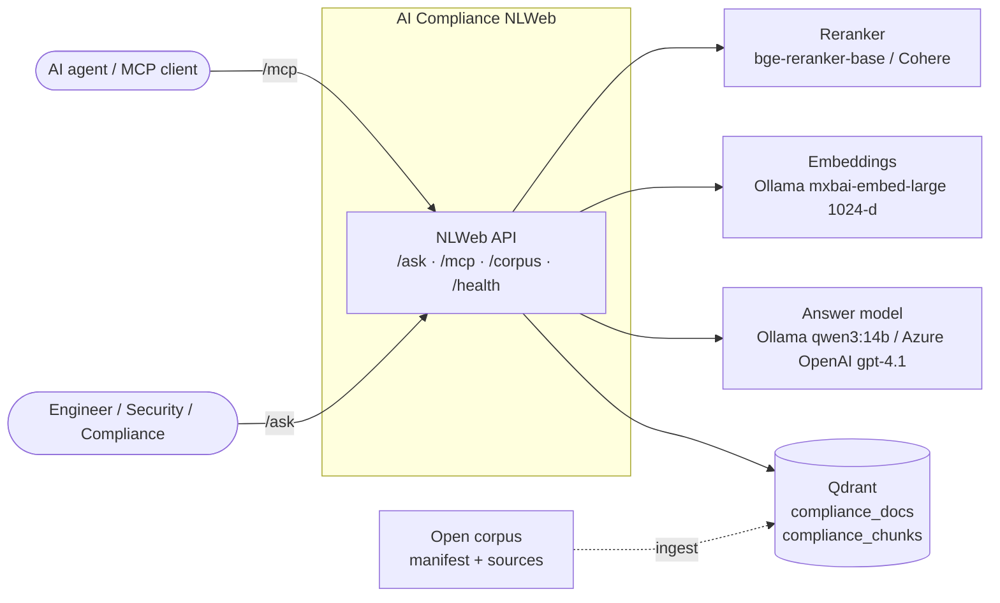
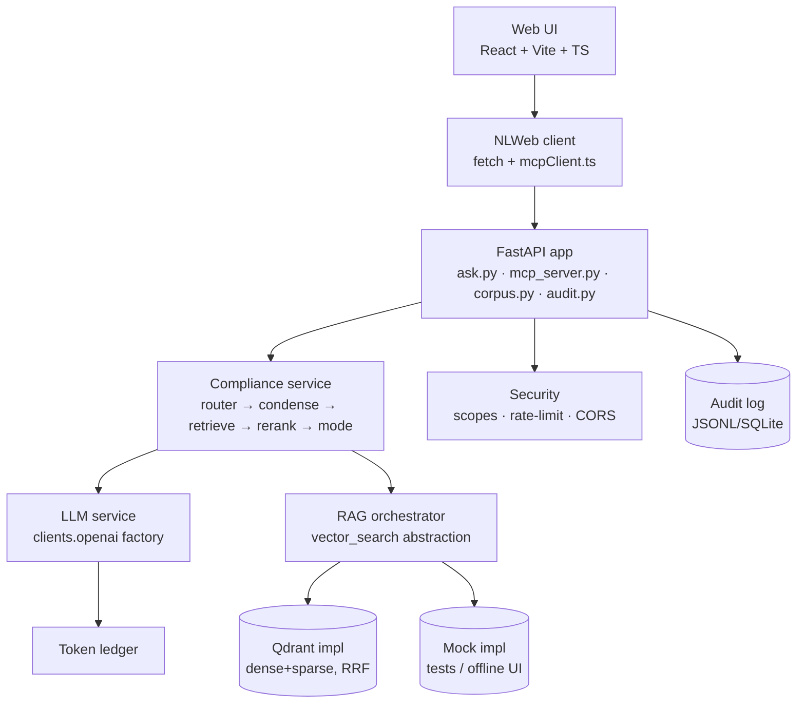

# 01 — Architecture

> Full diagram set lands in
> [`10-diagrams`](10-diagrams.md); this doc gives the working mental model.

## One core, two contracts
The system is a single **retrieval + answer core** exposed two ways (the NLWeb pattern):

- **`/ask`** — for humans/UI. Returns structured JSON shaped like a Schema.org `ItemList`,
  plus our extras (confidence, token usage, retrieval debug).
- **`/mcp`** — for agents. An MCP server (streamable HTTP, same FastAPI app) exposing the
  same core as tools (`ask_compliance`, `list_frameworks`, `get_framework`) and prompts.

Both accept the **same payload** (`query` required; `prev`, `decontextualized_query`,
`site`, `mode` optional). **Logic must not fork between the two endpoints** — they are thin
adapters over one service.

## C4 — Context

## C4 — Container (the prior "RAG Orchestrator" seam, kept)

The `vector_search` abstraction has a **Qdrant** implementation (`local`), an **Azure AI
Search** implementation (`azure`), and a **Mock** implementation, chosen by the `clients.py`
factory — this is the orchestrator seam from the prior architecture (`blog-architecture.png`),
and it makes
TDD and offline UI work possible without a live stack.

## Request flow (`/ask`)
1. **Validate** payload (`query` required).
2. **Router** classifies intent — `implementation` | `comparison` | `scoping/lookup` |
   `out_of_scope` (rules-first, LLM-fallback).
3. **Condense** multi-turn (`prev` → standalone `decontextualized_query`).
4. **Retrieve** — hybrid dense+sparse from Qdrant (Query API + **RRF**), with `site`/explorer
   selections AND-ed into the payload filter.
5. **Rerank** — top ~40 fused → cross-encoder → top ~8 (profile-gated, env toggle).
6. **`mode`** — `list` returns sources only (**no LLM**); `summarize` runs one
   citation-enforced synthesis pass; `generate` produces a templated artifact.
7. **Shape** — `ItemList` sources + answer + confidence; record **token ledger** and write
   an **audit** entry. Ledger/audit failures never break the answer path.

## Dual runtime profiles
`RUNTIME_PROFILE` selects a matched **{vector store, embedder, answer model}** triple:
- `local` — Qdrant + Ollama `mxbai-embed-large` (1024-d) embeddings + Ollama **`qwen3:14b`**
  answers. Runs entirely on Docker.
- `azure` — Azure AI Search + Azure OpenAI `text-embedding-3-small` (1536-d) embeddings +
  Azure OpenAI **`gpt-4.1`** answers, with prompt caching on the static system prompt + corpus
  framing. Auth via `DefaultAzureCredential`.

A vector store's dimension and embedding model are **immutable** once written, so the two
profiles use **separate stores**, each ingested independently — never embed one store with
the other's model. Profile branching lives in the `clients.py` factories, not in business
logic.

## Data model — two collections
- **`compliance_docs`** — one point per document (summary embedding): corpus explorer,
  framework routing, coarse recall.
- **`compliance_chunks`** — one point per section (structure-aware chunk): detailed retrieval
  + citations, carrying `section_path` (e.g. "Art. 9 §2") and `page`.

Both are 1024-d with **named dense + sparse vectors** for hybrid search. Details in
[`08-data-model`](08-data-model.md).

## Security (both endpoints)
Token scopes (`ask:read`, `mcp:invoke`), per-token/IP rate limiting, a locked CORS
allow-list, and audit logging of every call (`query_id`, principal, intent, sources, token
usage, latency). Local-dev uses a dev bearer-token fallback. See
[`21-security`](21-security.md) and [`ADR 0017`](../adr/0017-security-model.md).

## Local stack (Docker, project `compliance`)
`qdrant` · `ollama` (embeddings always; answers in `local`) · `reranker` (optional) ·
`unstructured` (PDF→text) · `bootstrap` (collections + model pulls) · `ingest` · `api` ·
`web`. The compose project name is **`compliance`** (never `local`). See
[`12-local-runtime`](12-local-runtime.md).

## Key references
- NLWeb contract details → [`09-api-reference`](09-api-reference.md),
  [`19-nlweb-ask-endpoint`](19-nlweb-ask-endpoint.md), [`20-mcp-server`](20-mcp-server.md).
- Retrieval/ranking → [`05-retrieval-and-ranking`](05-retrieval-and-ranking.md).
- Decisions → [`docs/adr/`](../adr/).
