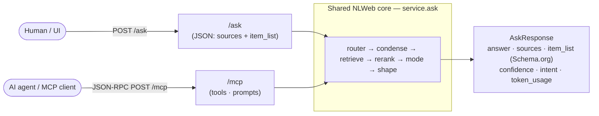
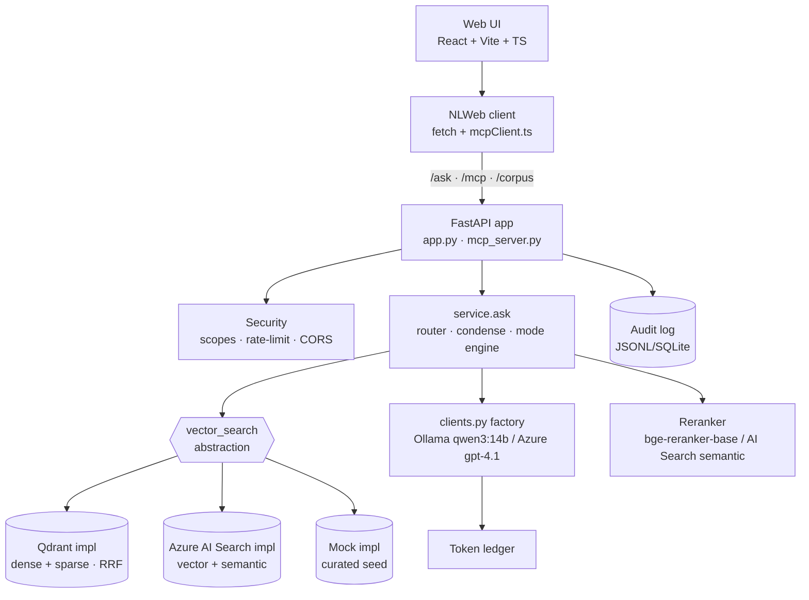
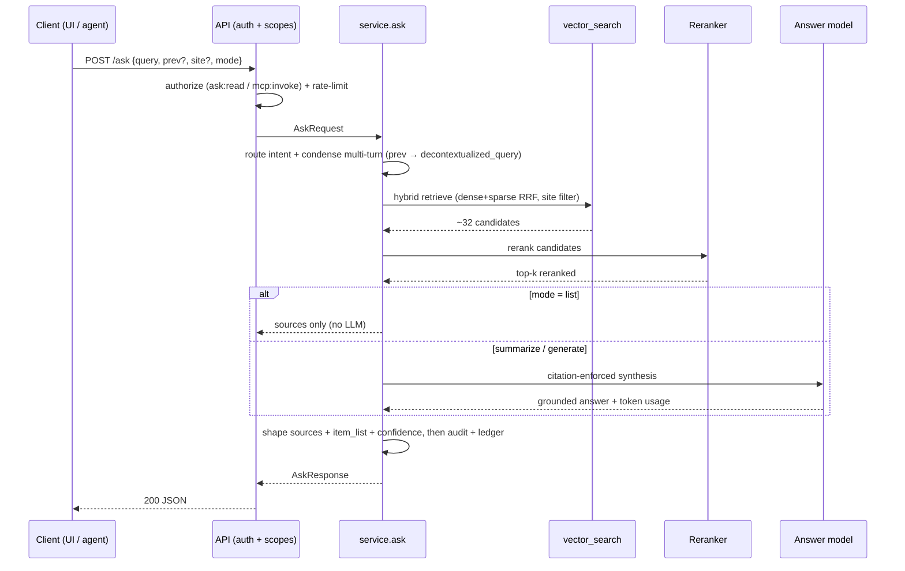
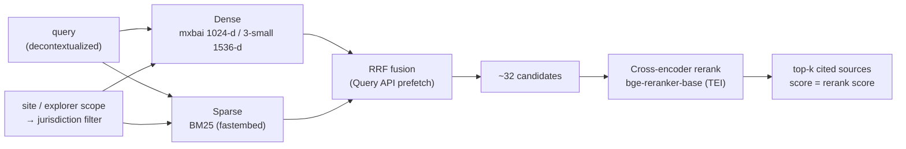
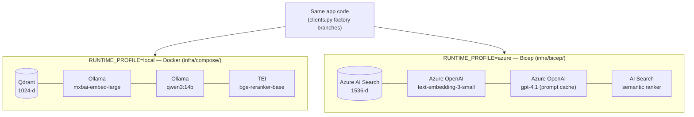
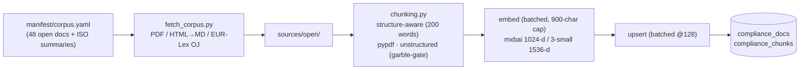
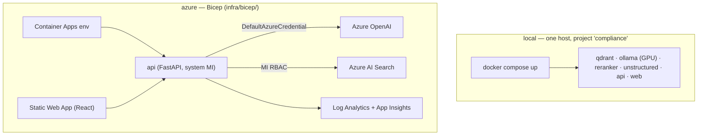

# 10 — Diagrams

> The canonical Mermaid diagram set. The working mental
> model + prose is in [`01-architecture`](01-architecture.md); endpoint contracts in
> [`19`](19-nlweb-ask-endpoint.md)/[`20`](20-mcp-server.md). These recreate (and supersede)
> the prior `blog-architecture.png` lineage image as living, version-controlled diagrams.

Live API reference: **`/docs`** (Swagger UI) · **`/redoc`** · **`/openapi.json`** — generated
from the FastAPI models, so it never drifts from the code.

---

## 1. NLWeb — one core, two contracts
The whole system is a single retrieval+answer core, exposed two ways. Logic never forks
between `/ask` and `/mcp`; they are thin adapters.

## 2. Container view (recreates `blog-architecture.png`)
The orchestrator seam: the `vector_search` abstraction is chosen by the `clients.py` factory,
so the same core runs over **Qdrant** (local), **Azure AI Search** (azure), or a **Mock**
(tests / offline UI) — without business logic knowing which.

## 3. `/ask` request flow (sequence)

## 4. Retrieval & ranking pipeline

## 5. Dual runtime profiles
`RUNTIME_PROFILE` selects a matched {vector store, embedder, answer model} triple. Stores are
**separate** because embedding dimension is immutable once written — never embed one store
with the other's model.

## 6. Ingestion pipeline

## 7. Deployment topology

See [`infra/bicep/README.md`](../../infra/bicep/README.md) for the cloud half and
[`12-local-runtime`](12-local-runtime.md) for the local half.
